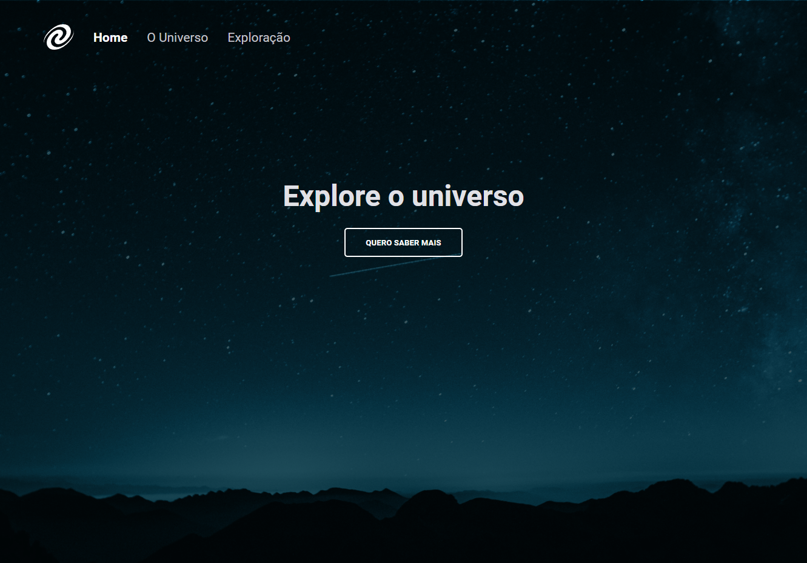

<h1 align="center"> SPA Universe</h1>

  <a href="#-technologies">Technologies</a>
  &nbsp;&nbsp;&nbsp;|&nbsp;&nbsp;&nbsp;
  <a href="#-functions">Functions</a>&nbsp;&nbsp;&nbsp;|&nbsp;&nbsp;&nbsp;
  <a href="#-project">Project</a>

 

  

 

## 🚀 Technologies

This project has been developed with the following technologies:

- HTML
- CSS
- JavaScript
- ES6(module)
- SPA

## 🛠️ Functions

- SPA concepts
- route mapping
- Async and promises
- Objetct orientation
- Class

## 💻 Project

The SPA Universe is a project of Explorer course from Rocketseat, an app to understand the concepts of SPA (Single page application).
